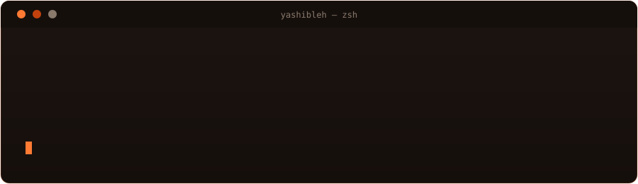

  

 

## the stack

  
  
  
  
   
  
  
  
  
  
   
  
  
  

## on the terminal

  

## currently

> _to be added_

## the record

  
  

  

## the trail

  

one-time GitHub Action setup needed — see notes below

  

